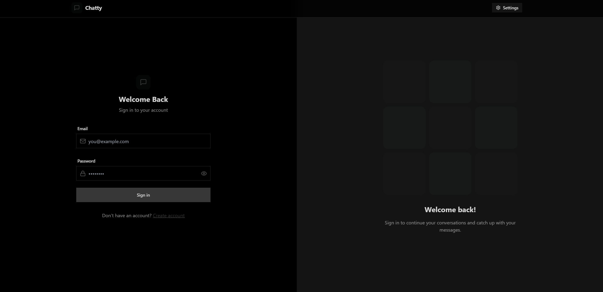
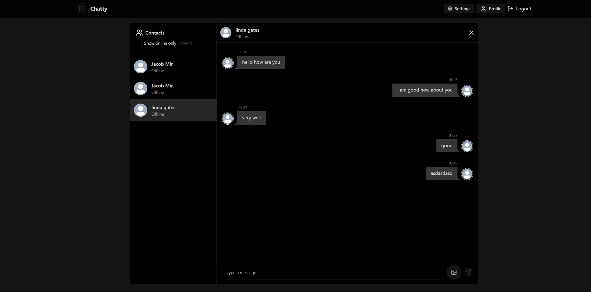
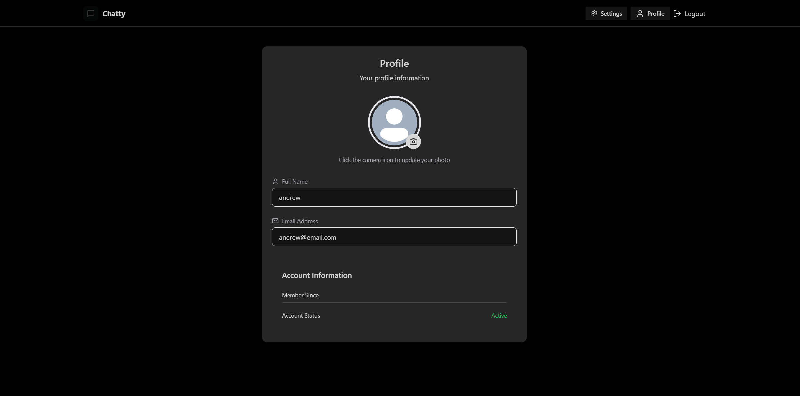
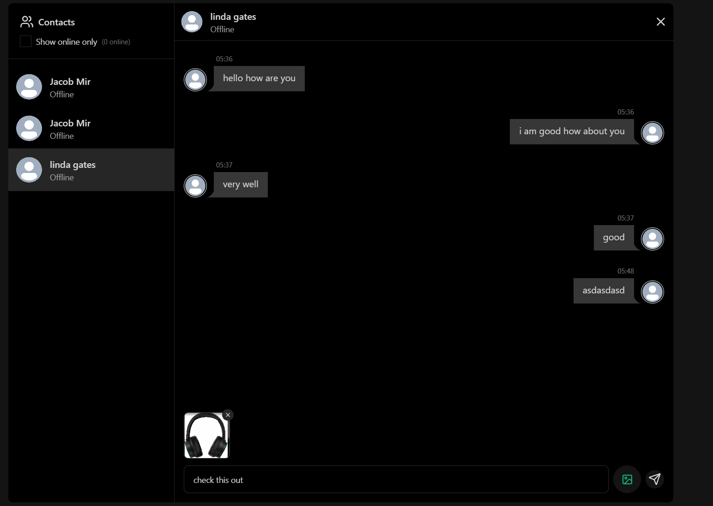
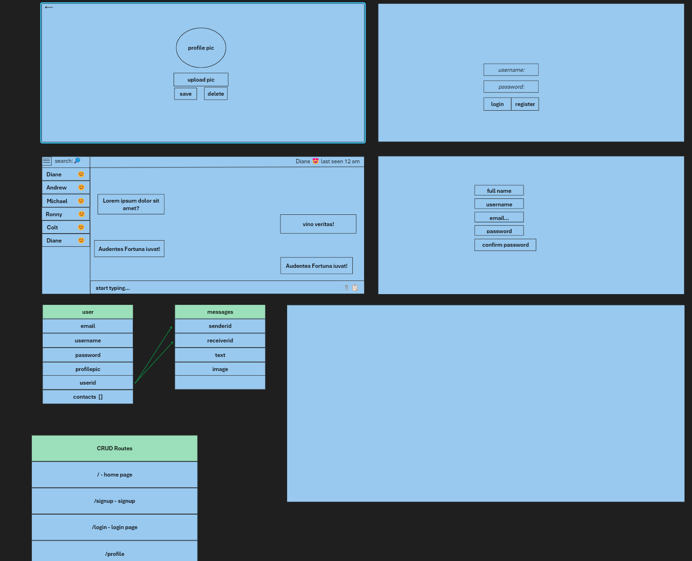
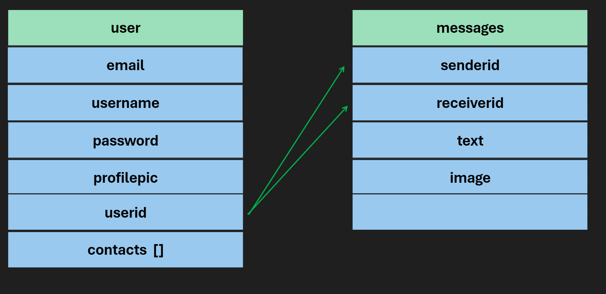

# APPLICATION NAME/APPLICATION TITLE

#### INSERT 1 SENTANCE SUMMARY OF YOUR APPLICATION/GAME HERE

landing login page image

example of chatting feature

profile information and image upload page

sending pictures example

## Description
It is a messaging app to message other people. You can send messages, images.

## Table of Contents
* [Technologies Used](#technologiesused)
* [Features](#features)
* [Design](#design)
* [Project Next Steps](#nextsteps)
* [Deployed App](#deployment)
* [About the Author](#author)

## Technologies Used
* Node.js
* Express
* JavaScript
* React
* Vite
* Tailwind CSS v3
* DaisyUI
* Socket.io
* Nodemon
* Lucide

## Features
Send pictures and text messages to other users

## Wireframe Images
* Description of image location, or 

## Microsoft whiteboard Planning
* Link to Microsoft whiteboard - https://wbd.ms/share/v2/aHR0cHM6Ly93aGl0ZWJvYXJkLm1pY3Jvc29mdC5jb20vYXBpL3YxLjAvd2hpdGVib2FyZHMvcmVkZWVtLzFlMDE5NDI5ZTZiZTRjMDI4NzVlYjFiNDU1NWU1YzJlX0JCQTcxNzYyLTEyRTAtNDJFMS1CMzI0LTVCMTMxRjQyNEUzRF8xZDQ0ODZmOS1hNjM4LTQyNGEtODI5Yy1lN2RjNGRlNmIyMjA=

## Design
Material design, Daisyui and lucide, i tried using those libraries

## DB Structure

this is the structure of my db

## Project Next Steps
#### List of Future Features
* figure out how to deploy it properly it kept crashing during deployment on render.com
* send videos
* send geotags
* send files 
* Users can change the theme.

## Deployed Link
render.com tried implementing it but it kept crashing.

* You can view the repository:
[Github.com](https://github.com/jacobworkdev/backendChat)
* If unable to view please go live locally through VS Code

## About The Author
I am interested in web development and IOT.
[Developer LinkedIn](https://www.linkedin.com/in/jakhongirm/)

## Special Mention: Supporters of the build
* Ozkan - [Add linked in links](https://www.youtube.com/watch?v=ntKkVrQqBYY&t=15762s)
